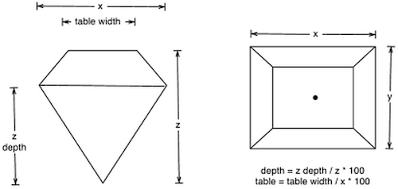

```{r setup, include=FALSE}
library(learnr)
knitr::opts_chunk$set(echo = TRUE)
```


# Diamonds: a case study

The diamonds dataset that we will use in this application exercise consists of prices and quality information from about 54,000 diamonds. We'll use it ad a gym to address data exploration and (a bit of) machine learning.

Pretend that this dataset was given you by a diamond trader. He wants to understant what influences the price of diamonds. What would you do?


## The dataset

The dataset contains information on prices of diamonds, as well as various attributes of diamonds, some of which are known to influence their price (in 2008 US Dollars): the 4 Cs (`carat`, `cut`, `color`, and `clarity`), as well as some physical measurements (`depth`, `table`, `price`, `x`, `y`, and `z`). 

Physical measurements are explained by the following picture. Credits to [Duke university](https://www2.stat.duke.edu/courses/Fall15/sta112.01/post/hw/HW1.html) for the pictures.

<center>


</center>

The carat is a unit of mass equal to 200 mg and is used for measuring gemstones and pearls. Cut grade is is an objective measure of a diamond’s light performance, or, what we generally think of as sparkle.

The figure below shows color grading of diamonds.

<center>


</center>

Lastly, the figure below shows clarity grading of diamonds.

<center>


</center>


## Data import

The `diamonds` dataset in included in `ggplot2`. Yes, R packages may contain datasets - and many do. Because datasets are important to showcase the features of the package.

Thus, you can simply load the dataset by running:

```{r}
library(ggplot2)
diamonds
```

But.

In real life, things are not that easy. Therefore, we'll go down the hard way and load the dataset from a file. Fortunately, a csv is available on github at the link https://raw.githubusercontent.com/tidyverse/ggplot2/master/data-raw/diamonds.csv.

Let us load tidyverse. The following command will load all the packages in the tidyverse.

```{r}
library(tidyverse)
library(magrittr)
```

We may talk about what conflicts are, but you can safely ignore them. 

One of the loaded packages is `readr`. Let's use it.

```{r}
raw_data_set = read_csv('https://raw.githubusercontent.com/tidyverse/ggplot2/master/data-raw/diamonds.csv')
raw_data_set
```

Nice! We have our dataset. But hold on! If we compare `data_set` with `diamonds`, we see that they are not the same. The types of the variables differ. In particular, the automatic type inference of `readr` has chose the type `character` for `cut`, `color` and `clarity`, while we know that they should be factors. We'll fix this in the next section.

## Data preparation

We want here to prepare our dataset for the analysis. 

We need to change the type of three columns: `cut`, `color`, and `clarity` should be ordered factors. We turn to tidyverse for help. 

```{r}
data_set = raw_data_set %>% 
  mutate(
    color = factor(
      color, 
      levels = c('D', 'E', 'F', 'G', 'H', 'I', 'J'), 
      ordered = T),
    cut = factor(
      cut, 
      levels = c("Fair", "Good", "Very Good", "Premium", "Ideal"), 
      ordered = T),
    clarity = factor(
      clarity, 
      levels = c("I1", "SI2", "SI1", "VS2", "VS1", "VVS2", "VVS1", "IF"), 
      ordered = T)
  )
data_set
```


## Data explorarion 1 - the basics

We start from the basics. How many variables (columns) and samples (rows) are there?

```{r}
data_set %>% 
  dim()
```

Good. Plenty of samples. How many missing values? 

```{r}
data_set %>% 
  is.na() %>%
  sum()
```

Great. None.

However, there still might be something wrong. Let us check for spatial dimensions...

```{r}
data_set %>% 
  filter(x * y * z <= 0)
```

Not good. What does it mean for a diamond to have 0 depth? It must be a mistake. 

Still, 20 samples over 54000 is not a big deal. Let us just remove them.

```{r}
data_set %<>% 
  filter(x > 0, y > 0, z > 0)
```

And check.

```{r}
data_set %>% 
  filter(x * y * z <= 0)
```

Nice. All looks ok now. Let's summarize the dataset.

```{r}
data_set %>% 
  summary()
```

It looks like the distributions of the numerical variables are quite skewed: there are a few very big values and lots of smaller ones. Let us take a look to the charts.


## Data Exploration 2 - the variables

Let us plot each variable. We will use `ggplot2` to achieve the goal.

```{r}
for (c in colnames(data_set %>% select(where(is.numeric)))){
  c_sym = sym(c)
  plt = ggplot(data = data_set, aes(x = !!c_sym)) +
    geom_histogram(bins = 200) + 
    ggtitle(paste0('Count of ', c)) +
    theme_light()
  print(plt)
}

for (c in colnames(data_set %>% select(-where(is.numeric)))){
  c_sym = sym(c)
  plt = ggplot(data = data_set, aes(x = !!c_sym)) +
    geom_histogram(stat = 'count') + 
    ggtitle(paste0('Count of ', c)) +
    theme_light()
  print(plt)
}
```

Normally, you would not duplicate the `for` loops, but we want to keep it simple. 

There are some outliers and it may be a good idea to remove them, but we will not do that. Moreover, we confirm that distributions are skewed and categorical variables are note balanced in the dataset.


## Data Explotation 3 - relationships

Let us use the power of R: its ecosystem of packages. We'll use the `GGally` package. Unfortunately, it is quite slow, thus we'll we'll sample 3000 rows randomly and focus first only on numerical variables.

```{r, fig.dim = c(9, 8)}
library(GGally)

set.seed(11)

sampled_data_set = data_set %>% 
  sample_n(3000)

sampled_data_set %>%
  select(where(is.numeric)) %>%
  ggpairs()
```

Then, price and categorical variables.

```{r, fig.dim = c(9, 8)}
sampled_data_set %>%
  select(-where(is.numeric), price) %>%
  ggpairs()
```

We see several interesting things:
1. There are variables which does not look very correlated with the target (e.g table)
2. There are variables which look very correlated with the target, like carat, x, y and z, with non-linear patterns
3. There are variables which look correlated with each other (e.g. x, y and z)

We want to better explore categorical variables with violin plots. We want to rule out the effect of weight, thus we use the price per carat.

```{r}
for (c in data_set %>% select(where(is.factor)) %>% colnames()){
  c_sym = sym(c)
  
  plt = ggplot(data_set, aes(x=!!c_sym, y=price/carat, fill=!!c_sym, color=!!c_sym)) +
    geom_violin(trim = FALSE) + 
    stat_summary(fun=median, geom="point", size=3, color="red") +
    ggtitle(paste0('Price per carat vs ', c)) + 
    theme_light()
  
  print(plt)
}
```

Yes, it definitely looks like these categorical variables influence the price.
Finally, we reproduce the scatter plot of carat vs price using the categorical variables as colors.

```{r}
for (c in data_set %>% select(where(is.factor)) %>% colnames()){
  c_sym = sym(c)
  
  plt = ggplot(data_set, aes(x=carat, y=price, color=!!c_sym)) +
    geom_point() + 
    ggtitle(paste0('Price vs carat with ', c)) + 
    theme_light()
  
  print(plt)
}
```

These charts completely confirm our previous conclusions. Moreover, they show curious vertical "lines".

In the end, so far we have highlighted that:
1. `table` and `depth` do not seem to have a great influence on the price.
2. `carat`, `x`, `y`, and `z` seem to influence a lot the target, but they also look related to each other.
3. The categorical variables `cut`, `color`, `clarity` bring complementary information to `carat`.


## Modelling

Here we go. Now we need to create a predictive model for the price of diamonds. We will use a linear regression.

We will exclude `depth` and `table` and we will choose `carat` among the variables related to size. Thanks to the white magic of R, we do not need to worry about how to transform categorical variables.

Before training the model, we will split train and test set.

```{r}
set.seed(11)
train_frac = 0.7

train_set = data_set %>% sample_frac(train_frac)
test_set = data_set %>% anti_join(train_set)
```

```{r}
dim(train_set)
```

```{r}
dim(test_set)
```

Then, we train the model, dropping useless and correlated variables.
 
```{r}
diamond_model = lm(price ~ carat + x + cut + clarity + color, data = train_set)
summary(diamond_model)
```

And we use it to predict prices in the test set. We can then assess our metric and the goodness of fit.

```{r}
test_set$price_pred = predict(diamond_model, test_set)
```

In order to assess the effectiveness of our model, we need a reference metric. We choose the mean absolute error. Let $y$ be the target variable and $\hat{y}$ its prediction: then, the MAE is

$$
\text{MAE} = \frac{1}{n}\sum_{i=1}^n |y - \hat{y}|
$$

We implement the metric with a function.

```{r}
mae = function(y, y_hat){
  mean(abs(y - y_hat))
}
```

And we use it on our predictions.

```{r}
mae(test_set$price, test_set$price_pred)
```

So, our MAE is above 750$. Let us look at the goodness of fit.

```{r}
ggplot(test_set, aes(x = price_pred, y = price)) + 
  geom_point(alpha = 0.1, color='#1f77b4') + 
  geom_abline(slope = 1, intercept = 0) + 
  theme_minimal() + 
  ggtitle("Goodness of fit")
```

That's not good at all. We have some negative predicted prices.

To avoid this issue, we can perform a log transformation on the target variable.

```{r}
diamond_model_log = lm(log(price) ~ carat + x + cut + clarity + color, data = train_set)
test_set$price_pred_log_model = predict(diamond_model_log, test_set) %>% exp()
mae(test_set$price, test_set$price_pred_log_model)
```

Good. The MAE has improved a lot. Let us look at the goodness of fit.

```{r}
ggplot(test_set, aes(x = price_pred_log_model, y = price)) + 
  geom_point(alpha = 0.1, color='#1f77b4') + 
  geom_abline(slope = 1, intercept = 0) + 
  theme_minimal() + 
  ggtitle("Goodness of fit - log model")
```

